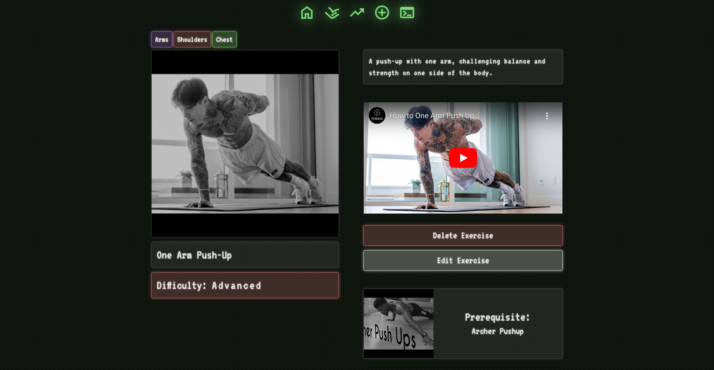
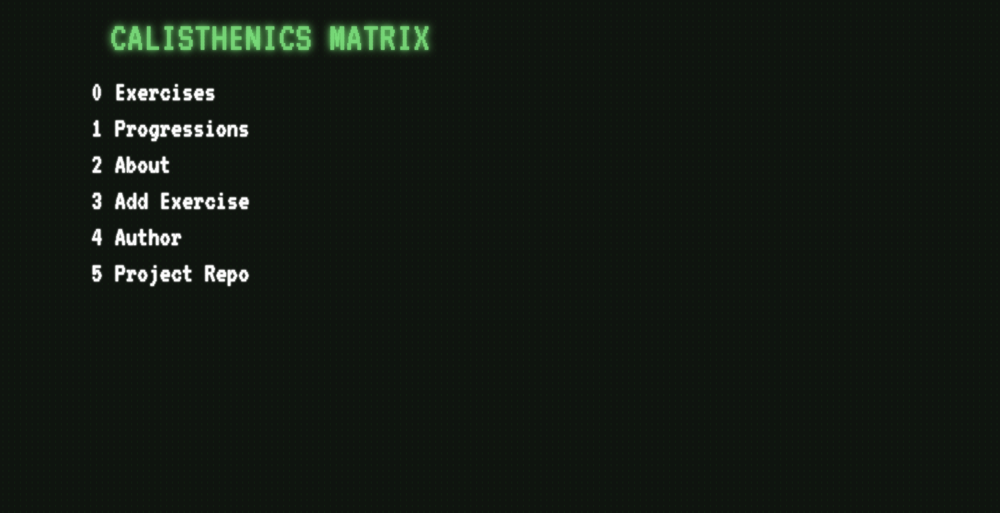
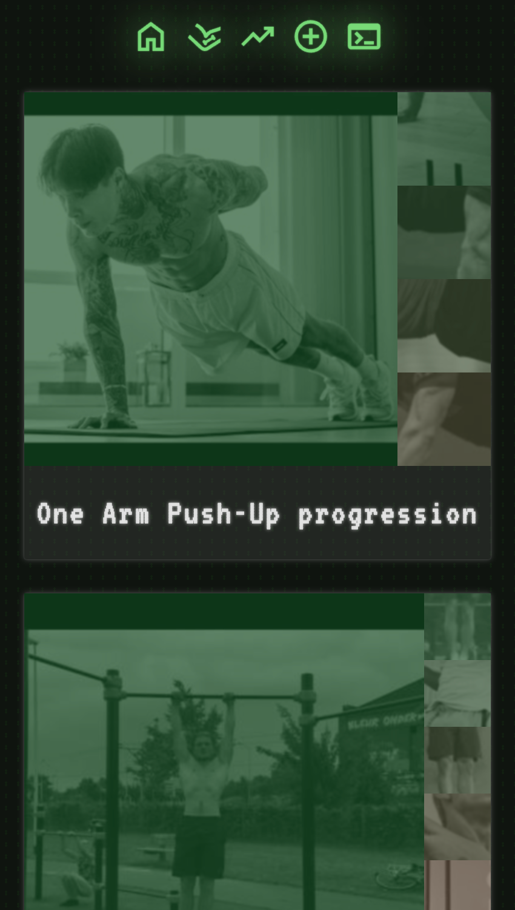
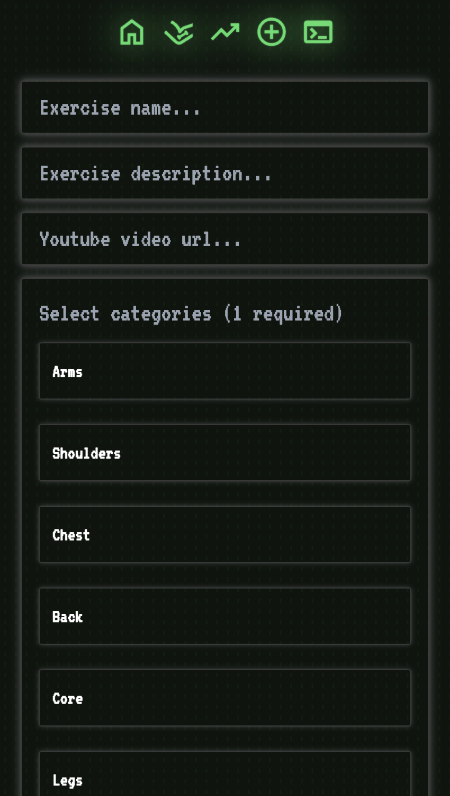
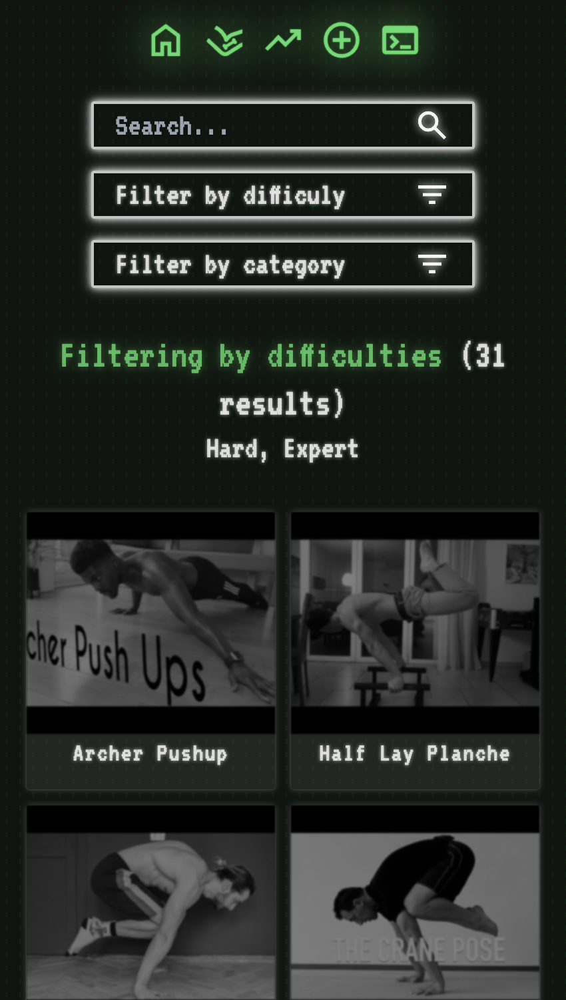
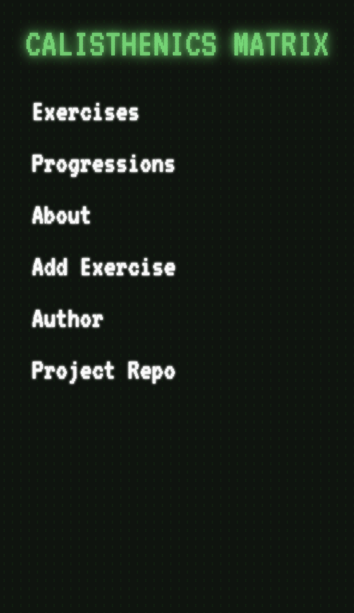

# Live Demo

🚀 **Experience the app live**: [Calisthenics Matrix](https://odin-inventory-app-production-c0c1.up.railway.app/)

Click the link above to explore the full functionality of the app, including exercise browsing, exercise progression planning, and more!

# Calisthenics Matrix

**Calisthenics Matrix** is a full-stack online exercise database designed to manage calisthenics skills effectively and astheically.
This project was built as part of [The Odin Project](https://www.theodinproject.com/) curriculum and demonstrates core skills in backend, frontend, and database management.





---

## Features

- **Inventory Management**

  - Add, update, delete, and view calisthenics skills items with ease.
  - Filter and search for exercises using various criteria.

- **Responsive Design**

  - Optimized for desktop, tablet, and mobile use.

- **Templating Engine**

  - Dynamic EJS templates ensure consistent and efficient UI rendering.

- **CRUD Functionality**

  - Fully integrated with PostgreSQL for robust data storage and manipulation.

- **Secure Environment Variables**
  - Utilizes `dotenv` to manage sensitive data like database credentials.

---

## Technologies Used

- **Backend**: Node.js, Express.js
- **Database**: PostgreSQL
- **Templating**: EJS
- **Environment Management**: dotenv
- **Deployment**: [Railway](https://railway.app/)

---

## Setup Instructions

### Prerequisites

- Node.js (v14+ recommended)
- PostgreSQL
- Git
- Railway (or another deployment platform)

### Local Installation

1. Clone the repository:

   ```bash
   git clone https://github.com/darwin-dev-diaz/odin-inventory-app.git
   cd odin-inventory-app
   ```

2. Install dependencies:

   ```bash
   npm install
   ```

3. Create a `.env` file in the root directory and add:

   ```env
   ROLE_PASSWORD=your_db_password
   ADMIN_PASSWORD=your_admin_password
   PORT=3000
   DATABASE_URL=your_postgresql_connection_url (if applicable)
   ```

4. Initialize the database:

   - Create a PostgreSQL database named `inventory_db`.
   - Run the database schema/setup script if provided.

5. Start the application:
   ```bash
   npm start
   ```
   The app will run on `http://localhost:3000` (or the port specified in the `.env` file).

---

## Usage

1. Access the homepage to view all inventory items.
2. Use the interface to add, edit, delete, or filter items.
3. Navigate through a responsive and user-friendly UI.

---

## Deployment

### On Railway

1. Push your code to GitHub.
2. Connect the repository to Railway.
3. Add the required environment variables:
   - `DATABASE_URL`
   - `ADMIN_PASSWORD`
4. Deploy and verify functionality.

---

## Preview

<div style="display: flex; gap: 10px; justify-content: center; align-items: center; flex-wrap: wrap;">
  
  
  
  
</div>
